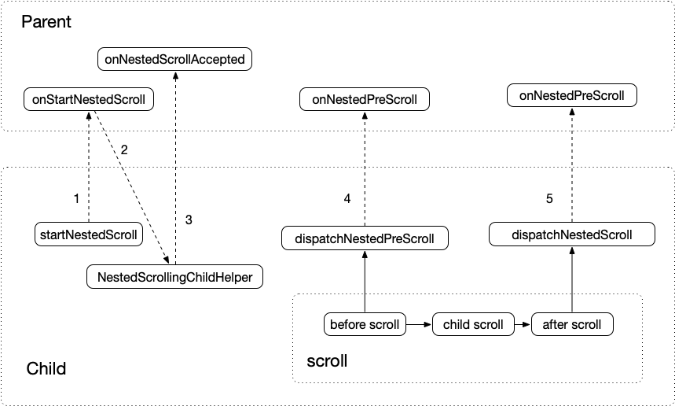

### 三级 NestedScroll 嵌套滚动实践

#### 嵌套滚动介绍

我们知道 NestedScrolling(Parent/Child) 这对接口是用来实现嵌套滚动的，而且一般实现这对接口的 Parent 和 Child 没有直接嵌套，否则直接用 onInterceptTouchEvent() 和 onTouchEvent() 这对方法实现就可以了。因此能够越级实现潜逃滚动正是它的厉害之处。

嵌套滚动的接口有两对：NestedScrolling(Parent/Child) 和 NestedScrolling(Parent2/Child2) 后者相比前者对 fling 的处理更加细致。相比第一代 Child 简单地将 fling 抛给 Parent，第二代 Child 将 fling 转化为 scroll 后再分发给 Parent，为了和普通的 scroll 区分增加了一个属性 type, 当 type 是 ViewCompat.TYPE_TOUCH 时表示普通的 scroll，当是 ViewCompat.TYPE\_NON\_TOUCH 时表示由 fling 转化而来的 scroll。这样做的好处是当 Child 检测到一个 fling 时，它可以选择将这个 fling 引起的 scroll 一部分作用在 Parent 上一部分作用在自己身上，而不是只作用在 Parent 或者 Child 上。或许你会问 fling 为什么不能选择 Parent 和 Child 都作用，事实上你可以，但 fling 的话 Parent 没法告诉 Child 消费了多少，剩下多少，因为 fling 传递的值是速度，不像 scroll 是距离。所以通过 NestedScrolling(Parent2/Child2) 实现嵌套滚动时，当你触发了一个 fling 时，也可以做很顺滑连贯的交替滚动，而 1 就很难达到相同的效果。现在官方 View 的实现也是通过 2，所以我们在实现自定义的嵌套滚动时尽量用 2。

上面简单介绍了 NestedScrolling 2 和 1 的区别以及为什么要使用2。现在我们来看看 NestedScrolling(Parent2/Child2) 的方法，1 就不看了，和 2 差不多。

``` java
public interface NestedScrollingChild2 {

    void setNestedScrollingEnabled(boolean enabled);

    boolean isNestedScrollingEnabled();

    boolean startNestedScroll(@ScrollAxis int axes, @NestedScrollType int type);
    
    void stopNestedScroll(@NestedScrollType int type);

    boolean hasNestedScrollingParent(@NestedScrollType int type);

    boolean dispatchNestedScroll(int dxConsumed, int dyConsumed,
            int dxUnconsumed, int dyUnconsumed, @Nullable int[] offsetInWindow,
            @NestedScrollType int type);
            
	boolean dispatchNestedPreScroll(int dx, int dy, @Nullable int[] consumed,
            @Nullable int[] offsetInWindow, @NestedScrollType int type);
}
```

```java
public interface NestedScrollingParent2 {

	boolean onStartNestedScroll(@NonNull View child, @NonNull View target, @ScrollAxis int axes,
            @NestedScrollType int type);
            
	void onNestedScrollAccepted(@NonNull View child, @NonNull View target, @ScrollAxis int axes,
            @NestedScrollType int type);
            
	void onStopNestedScroll(@NonNull View target, @NestedScrollType int type);

	void onNestedScroll(@NonNull View target, int dxConsumed, int dyConsumed,
            int dxUnconsumed, int dyUnconsumed, @NestedScrollType int type);

	void onNestedPreScroll(@NonNull View target, int dx, int dy, @NonNull int[] consumed,
            @NestedScrollType int type);
}
```

从这两个接口的方法可以看出这些方法都是一一对应的，比如 startNestedScroll 和 onStartNestedScroll，stopNestedScroll 和 onStopNestedScroll 等。从这些方法的命名上也能看出来嵌套滚动的交互顺序是 Child 主动分发，Parent 被动接受，所以决定是否打开嵌套滚动的方法 setNestedScrollingEnabled 由 Child 实现，决定开始和结束的方法 startNestedScroll 和 stopNestedScroll 也由 Child 实现。

这里用一个图来表示嵌套滚动流程



整个过程大概分为两部分：绑定和滚动分发。绑定部分可以理解为 Child 向上遍历找 NestedScrollingParent2 的过程，当遇到 Parent 是 NestedScrollingParent2 的实例，调用它的 onStartNestedScroll 方法，如果返回 true 则说明这个 Parent 想接收 nested scroll，Child 会紧接着调 onNestedScrollAccepted 方法表示同意 Parent 处理自己分发的 nested scroll，对应上图中的 1 2 3 步。滚动分发部分 Child 将自己的 scroll 分为三个阶段 before scroll after，before 和 after 分发给 parent 消费，scroll 阶段让自己消费，这三个阶段是按顺序进行的，换句话说如果前一步消耗完了 scroll，那后面的阶段就没有 scroll 可以消费。这样做的好处是让 Parent 可以在自己消费之前或者之后消费 scroll，很明显如果 Parent 想在 Child 之前消费就在 onNestedPreScroll 方法里处理，否则就在 onNestedScroll 方法里，对应上图中的 4 5 步。上面介绍到的一些通用逻辑被封装在 NestedScrollingChildHelper 和 NestedScrollingParentHelper 中，在 NestedScrolling(Parent2/Child2) 的方法中可以调用 Helper 类中的同名方法，比如 NestedScrollingChild2.startNestedScroll 方法中实现了向上遍历寻找 NestedScrollingParent 的逻辑。

#### 三级嵌套滚动


