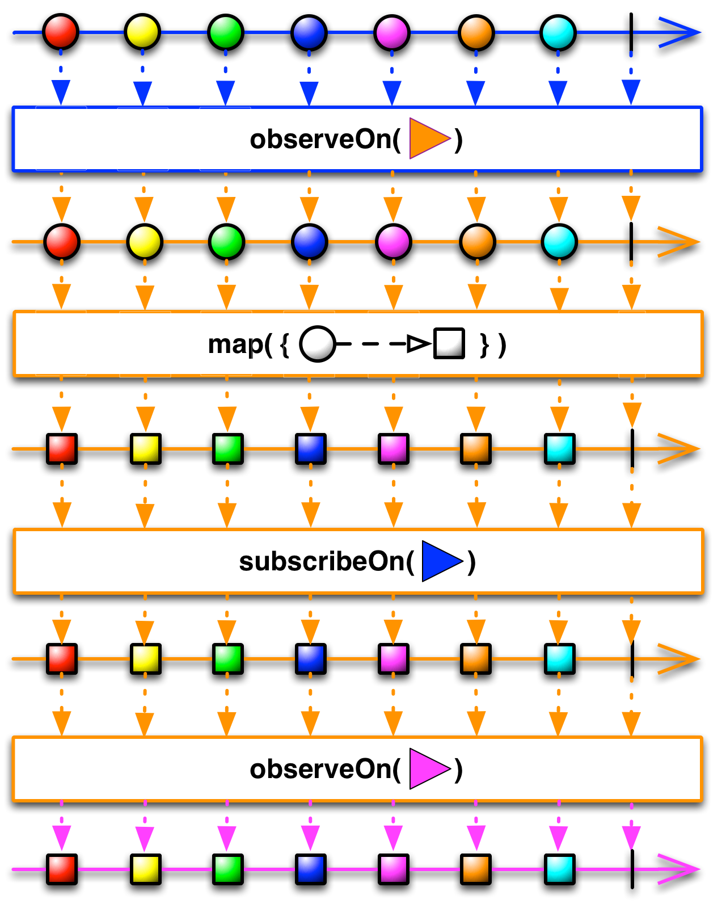

##Reactive

在Reactivex中，observer订阅Observable.observer会响应Observable发送的一个或一组数据。这种模式适合并发操作，因为observer不需要阻塞等待Observable发送数据，但是observer会建立模式等待Observable发送数据。

###reactivex pattern
异步

* Observable
定义如何获取数据，转换数据。
Observable通过调用Observer的方法来发送数据或者通知。


* Observer(Subscriber, watcher, reactor)
定义对收到的数据如何响应。


* subscribe
连接Observable和Observer


* operator
连接多个Observable,改变Observable行为。

```
example:

- ordinary method call
// make the call, assign its return value to `returnVal`
returnVal = someMethod(itsParameters)
// do something useful with returnVal

- asynchronous model
// defines, but doesn't invoke, the Subscriber's onNext handler
// (in this example, the observer is very simple and has only an onNext handler
def myOnNext = { it -> do something useful with it };
// defines, but doesn't invoke, the Observable
def myObservable = someObservable(itsParameters);
// subscribes the Subscriber to the Observable, and invokes the Observable 订阅出触发了Observable里面的操作
myObservable.subscribe(myOnNex);
// go on other business
```


* onNext, onCompleted, onError - Observer可以实现的方法

* subscribe将observer和Observable连接起来

* onNext - Observable调用这个方法发送数据,参数：Observable发送的数据
onError - Observable调用这个方法来告诉Observer发生了错误，这时Observable中的操作会终止，后面本应该调用的onNext 和 onCompleted也不会调用。参数：Throwable
onCompleted - Observable最后一次调用onNext,并且没有错误发生。

> onNext调用次数： 0 ～ 多次   ----- emission  
> onCompleted / onError : 一次 ----- notification

```
/*********************/
// example:

def myOnNext = { item -> /* do something(显示图片) */ };
def myError = { thowable -> /* react to a fail call(重试/显示默认图片/提示出错信息) */ }；
def myComplete = { clean up after operation(关闭连接) };
def myObservable = someMethod(itsParameters/*(下载图片)*/);
myObservable.subscribe(myOnNext, myError, myComplete);
// go on other business

/*********************/
```


###unsubscribing

有的ReactiveX实现里有Subscriber接口，实现了unsubscribe方法，用来终止Subscribe。调用这个方法会导致Observable停止发送数据，这个停止操作不是马上起效的。

###Hot and Cold Observable

决定Observable什么时候发送数据。
Hot - Observale 创建的时候就开始发送数据， 有可能Observable发送数据一半，Observer才开始接收数据。
Cold - Observable 被subscirbe的时候发送数据， 保证Observer收到所有数据。
Connectable - 不管有没有订阅，在connect方法调用之后才开始发送数据。

Chaining Operators
在Observable上的操作符返回的还是一个Observable对象，这样就可以在Observable上链式调用多个操作符。

###Operators

分类：

- Creating Observable
- Transforming Observable
- Filtering Observable
- Combining Observable
- Error Handling Operators
- Observable Utility Operators
- Conditional and Boolean Operators
- Mathematical and Aggregate Operators
- Backpressure Operators
- Connectable Observable Operators
- Operators to Convert Observables


###Scheduler

Schedulers.io()
Schedulers.computation()

###多线程

subscribeOn()
- 指定Observable和在上面作用的操作符开始应该在哪个线程，不管在什么位置调用
observeOn()
- 指定在这个操作符后面的操作应该运行的线程




###Example:

```
// Observable
Observable<String> myObservable = Observable.create(
    new Observable.OnSubscribe<String>() {
        @Override
        public void call(Subscriber<? super String> sub) {
            sub.onNext("Hello, world!");
            sub.onCompleted();
        }
    }
);
	

// observer/subsciber
Subscriber<String> mySubscriber = new Subscriber<String>() {
    @Override
    public void onNext(String s) { System.out.println(s); }

    @Override
    public void onCompleted() { }

    @Override
    public void onError(Throwable e) { }
};

myObservable.subscribe(mySubscriber);
// outputs "Hello, world"


	||
	||
	\/

Observable<String> myObservable = Observable.just("Hello， world!");

Action1<String> onNextAction = new Action1<String>() {
	@Override
	public void call(String s) {
		System.out.println(s);
	}
};

myObservable.subscribe(onNextAction, onErrorAction, onCompleteAction);

	||
	||
	\/

myObservable.subscribe(onNextAction);

	||
	||
	\/

Observable.just("Hello, world!")
	.subscribe(new Action1<String>() {
		@Override
		public void call(String s) {
			System.out.println(s);
		}
	});

	||
	||
	\/

Observable.just("Hello, world!")
	.subscribe(s -> System.out.println(s));


Observable.just("Hello, world! -Dan")
    .subscribe(s -> System.out.println(s));

	||
	||
	\/

Observable.just("Hello, world!")
    .subscribe(s -> System.out.println(s + " -Dan"));

	||
	||
	\/

Observable.just("Hello, world!")
    .map(s -> s + " -Dan")
    .subscribe(s -> System.out.println(s));

	||
	||
	\/

// change type
Observable.just("Hello, world!")
    .map(s -> s.hashCode())
    .subscribe(i -> System.out.println(Integer.toString(i)));

	||
	||
	\/

Observable.just("Hello, world!")
    .map(s -> s.hashCode())
    .map(i -> Integer.toString(i))
    .subscribe(s -> System.out.println(s));

	||
	||
	\/

Observable.just("Hello, world!")
    .map(s -> s + " -Dan")
    .map(s -> s.hashCode())
    .map(i -> Integer.toString(i))
    .subscribe(s -> System.out.println(s));


-FlatMap

// Returns a List of website URLs based on a text search
Observable<List<String>> query(String text); 

query("Hello, world!")
    .subscribe(urls -> {
        for (String url : urls) {
            System.out.println(url);
        }
    });


	||
	||
	\/

query("Hello, world!")
    .subscribe(urls -> {
        Observable.from(urls)
            .subscribe(url -> System.out.println(url));
    });

	||
	||
	\/

query("Hello, world!")
    .flatMap(new Func1<List<String>, Observable<String>>() {
        @Override
        public Observable<String> call(List<String> urls) {
            return Observable.from(urls);
        }
    })
    .subscribe(url -> System.out.println(url));

	||
	||
	\/

query("Hello, world!")
    .flatMap(urls -> Observable.from(urls))
    .subscribe(url -> System.out.println(url));

	||
	||
	\/

query("Hello, world!")
    .flatMap(urls -> Observable.from(urls))
    .flatMap(new Func1<String, Observable<String>>() {
        @Override
        public Observable<String> call(String url) {
            return getTitle(url);
        }
    })
    .subscribe(title -> System.out.println(title));


	||
	||
	\/

query("Hello, world!")
    .flatMap(urls -> Observable.from(urls))
    .flatMap(url -> getTitle(url))
    .subscribe(title -> System.out.println(title));

	||
	||
	\/

query("Hello, world!")
    .flatMap(urls -> Observable.from(urls))
    .flatMap(url -> getTitle(url))
    .filter(title -> title != null)
    .subscribe(title -> System.out.println(title));


	||
	||
	\/

query("Hello, world!")
    .flatMap(urls -> Observable.from(urls))
    .flatMap(url -> getTitle(url))
    .filter(title -> title != null)
    .take(5)
    .subscribe(title -> System.out.println(title));

	||
	||
	\/

query("Hello, world!")
    .flatMap(urls -> Observable.from(urls))
    .flatMap(url -> getTitle(url))
    .filter(title -> title != null)
    .take(5)
    .doOnNext(title -> saveTitle(title))
    .subscribe(title -> System.out.println(title));
```

?doOnNext() vs subscribe()
?subscribe() 

